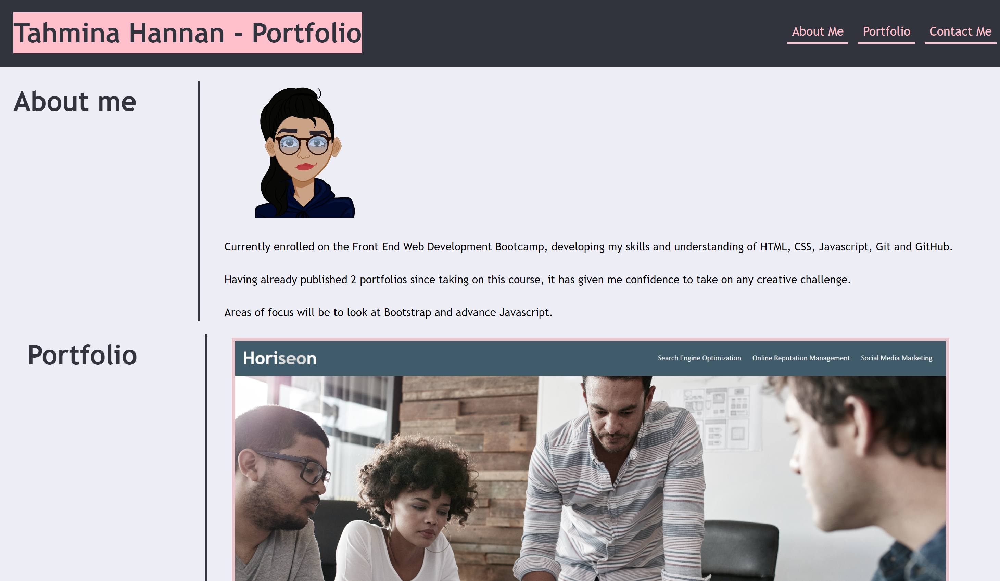

# Bootstrap-Portfolio

## About this project
Working with my previous portfolio using only CSS and HTML, this time i'm revamping my portfolio using Bootstrap. 

## Screenshot
The following shows the web applications mock up appearance I used to guide my current portfolio:

## Project Link
Application can can be viewed here: 
* [Live](https://tahminahannan.github.io/Bootstrap-Portfolio/)

* [Repository](https://github.com/TahminaHannan/Bootstrap-Portfolio)

## Built with:
* HTML
* CSS:
* Bootstrap
* Gitbash

(Note for future self - Media queries (Smallest Screen size: 0-769px | Next Screen Size: 770px-979px | Largest Screen Size: 980px - ~ )

## Tests
Tested the website functionality using:
* [w3 - Validator](https://validator.w3.org/nu/)

## Credits
I would like to thank the following resources:
* [Get Bootstrap ](https://getbootstrap.com/docs/4.3/components/alerts/)
* [Bootstrap Shuffle ](https://bootstrapshuffle.com/classes)

## License
Distributed under the MIT License. See LICENSE.txt for more information.